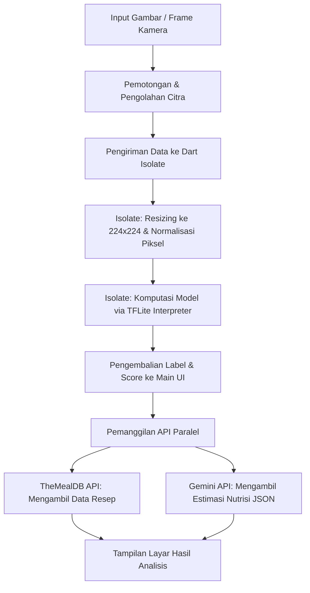

# Food Recognizer App 🍕🔍

Food Recognizer App adalah aplikasi Flutter berbasis Machine Learning (ML) dan Generative AI yang dirancang untuk mengidentifikasi berbagai jenis makanan secara instan. Aplikasi ini dapat menganalisis gambar makanan baik melalui pemindaian kamera secara langsung (*Live Scan*), pengambilan foto baru, maupun pengunggahan dari galeri perangkat. 

Setelah makanan teridentifikasi, aplikasi secara otomatis menyajikan informasi kandungan gizi (kalori, karbohidrat, lemak, serat, protein) menggunakan integrasi Google Gemini AI serta menampilkan referensi resep masakan dari API TheMealDB.

Proyek ini dikembangkan sebagai bagian dari submission tugas akhir pembelajaran kelas **Expert Multi-Platform AI App Development - IDCamp 2025 & Dicoding Indonesia**.

---

## 🚀 Fitur Utama

1. **Food Image Classification (Offline Inference)**
   - Klasifikasi jenis makanan secara lokal menggunakan model TensorFlow Lite (TFLite) `Food-Classifier`.
   - Klasifikasi mendukung pemindaian langsung dari kamera (*Live Stream Scanning*) atau analisis gambar statis (*Static Inference*).
2. **Optimasi Performa dengan Multi-threading (Dart Isolate)**
   - Proses pengolahan piksel gambar (resizing ke $224 \times 224$ dan normalisasi piksel) serta komputasi model TFLite dijalankan pada **Dart Isolate** terpisah. Hal ini menjaga agar *Main Thread UI* tetap responsif tanpa mengalami *frame dropping* (lag).
3. **Dynamic Model Update (Firebase ML Integration)**
   - Penerapan sinkronisasi model TFLite dinamis menggunakan **Firebase ML Model Downloader**. Model diperbarui secara otomatis di latar belakang (*background update*) tanpa perlu memperbarui atau merilis ulang aplikasi di Play Store / App Store.
4. **AI-Powered Nutrition Analysis (Google Gemini AI)**
   - Integrasi dengan **Google Generative AI SDK (Gemini API - Model `gemini-2.5-flash`)** untuk memberikan taksiran informasi kandungan gizi secara detail.
   - Menggunakan konfigurasi `responseSchema` dengan tipe MIME `application/json` untuk memastikan data gizi ter-parsing ke dalam UI secara konsisten dan aman.
   - Dilengkapi sistem cache lokal untuk mencegah pemanggilan API yang redundan untuk jenis makanan yang sama.
5. **Recipe Retrieval (TheMealDB REST API)**
   - Menghubungkan hasil klasifikasi makanan ke database kuliner online **TheMealDB** untuk memuat daftar bahan masakan dan petunjuk pembuatan hidangan.
6. **Built-in Image Cropper**
   - Fitur memotong (*crop*) dan memutar (*rotate*) gambar sebelum dianalisis untuk memastikan area makanan terfokus secara tepat.

---

## 📂 Struktur Repositori

Proyek ini dirancang secara modular untuk memisahkan logika bisnis, layanan eksternal, manajemen state, dan tampilan antarmuka. Berikut adalah subtree struktur direktori proyek:

```text
food_recognizer_app/
├── assets/
│   └── labels.txt                      # Label klasifikasi kelas makanan
├── lib/
│   ├── controller/                     # State Management (ChangeNotifier)
│   │   ├── home_controller.dart        # Mengatur pemilihan & pemotongan gambar
│   │   └── result_controller.dart      # Mengatur proses inferensi, API Gemini & MealDB
│   ├── env/                            # Konfigurasi Environment & Obfuscation
│   │   ├── env.dart                    # Definisi kunci env menggunakan Envied
│   │   └── env.g.dart                  # Generated file (diabaikan dari Git)
│   ├── service/                        # Komunikasi Service & Integrasi SDK
│   │   ├── firebase_ml_service.dart    # Handler unduh model Firebase ML
│   │   ├── gemini_nutrition_service.dart # Handler Generative AI Gemini
│   │   ├── image_classification_service.dart # Interpreter & setup inferensi TFLite
│   │   ├── isolate_inference.dart      # Logika multi-threading Dart Isolate
│   │   └── meal_db_service.dart        # Fetching resep dari TheMealDB API
│   ├── ui/                             # Layer Antarmuka Pengguna (UI)
│   │   ├── camera_page.dart            # Tampilan live scanner kamera
│   │   ├── home_page.dart              # Tampilan utama pemilih input gambar
│   │   └── result_page.dart            # Tampilan hasil analisis ML & AI
│   ├── utils/                          # Helper / Utilitas
│   │   └── image_utils.dart            # Konversi format kamera YUV420 ke RGB
│   ├── widget/                         # Custom UI Widget
│   │   └── classification_item.dart    # Tampilan visual hasil score ML
│   ├── firebase_options.dart           # Opsi inisialisasi Firebase
│   └── main.dart                       # Entry point aplikasi & Provider Setup
├── .env                                # File API Key (diabaikan dari Git)
├── pubspec.yaml                        # Dependensi proyek Flutter
└── README.md
```

---

## 🛠️ Prasyarat Sistem

Sebelum menjalankan proyek ini, pastikan mesin pengembangan Anda memenuhi prasyarat berikut:

* **Flutter SDK**: `^3.7.0`
* **Dart SDK**: `^3.7.0`
* **JDK Version**: JDK 17 (sangat direkomendasikan untuk stabilitas Gradle pada Android)
* **Android SDK**: Target SDK level 34 hingga 36
* **Firebase Project**: Akun Firebase aktif untuk menghubungkan Firebase ML

---

## ⚙️ Langkah Instalasi & Konfigurasi

### 1. Kloning Repositori
Kloning repositori ini ke komputer lokal Anda:
```bash
git clone https://github.com/username/food-recognizer-app.git
cd food-recognizer-app
```

### 2. Unduh Dependensi Flutter
Pasang pustaka-pustaka yang diperlukan menggunakan perintah:
```bash
flutter pub get
```

### 3. Konfigurasi Firebase (Firebase ML)
Karena aplikasi ini mengunduh model klasifikasi secara dinamis dari cloud, Anda perlu menghubungkan aplikasi dengan Firebase Project Anda:
1. Daftarkan aplikasi Android dan iOS Anda pada Konsol Firebase.
2. Unduh berkas konfigurasi Firebase:
   - Android: Letakkan berkas `google-services.json` ke direktori `android/app/`.
   - iOS: Letakkan berkas `GoogleService-Info.plist` ke direktori `ios/Runner/`.
3. Aktifkan **Firebase ML** pada Firebase Console Anda, lalu unggah model klasifikasi TFLite Anda dengan nama model **`Food-Classifier`**.
4. Perbarui berkas [lib/firebase_options.dart](lib/firebase_options.dart) menggunakan FlutterFire CLI jika konfigurasi platform Anda berbeda.

### 4. Konfigurasi API Key & Envied (Keamanan)
Aplikasi ini memanfaatkan paket `envied` untuk menyamarkan (*obfuscate*) kunci API Gemini agar tidak mudah diekstrak melalui teknik *reverse engineering*.

1. Buat berkas bernama `.env` pada direktori root proyek Anda (sejajar dengan `pubspec.yaml`).
2. Masukkan Gemini API Key Anda ke dalam berkas tersebut:
   ```env
   GEMINI_API_KEY=AIzaSyYourGeminiApiKeyHere_xxxxxxxx
   ```
3. Generate berkas pendukung keamanan `env.g.dart` secara otomatis dengan menjalankan perintah berikut di terminal:
   ```bash
   dart run build_runner build -d
   ```
   *Catatan: Berkas `.env` dan [lib/env/env.g.dart](lib/env/env.g.dart) telah dikecualikan dalam `.gitignore` demi menjaga keamanan API Key dari kebocoran ke repositori publik.*

---

## 🚀 Menjalankan Aplikasi

Pastikan perangkat emulator atau *physical device* (Android/iOS) sudah terhubung ke komputer Anda, kemudian jalankan perintah:
```bash
flutter run
```

---

## 📊 Detail Teknis Inferensi & Aliran Data

Alur analisis makanan di dalam aplikasi berjalan melalui tahapan-tahapan berikut:



1. **Preprocessing Citra**: Gambar masukan didekode secara asinkron menggunakan pustaka `image`. Citra kemudian disesuaikan ukurannya (*resize*) ke dimensi $224 \times 224$ piksel sesuai dengan format tensor input model.
2. **Inference Threading**: Berkas [lib/service/isolate_inference.dart](lib/service/isolate_inference.dart) mendistribusikan beban kalkulasi ke thread latar belakang (`Isolate`). Interaksi interpreter TFLite dilakukan dengan memori pointer (`Interpreter.fromAddress`) agar prosesnya instan dan efisien.
3. **Structured Nutrition Prompting**: Pengambilan estimasi gizi di [lib/service/gemini_nutrition_service.dart](lib/service/gemini_nutrition_service.dart) memaksa model generative AI untuk memberikan balasan berformat JSON kaku dengan struktur kunci:
   - `kalori`
   - `karbohidrat`
   - `lemak`
   - `serat`
   - `protein`
